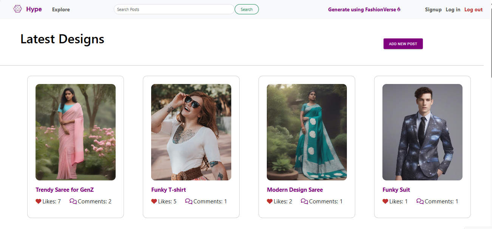
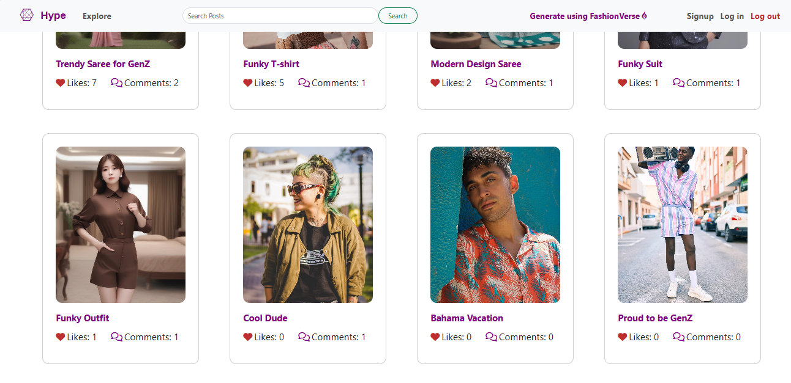
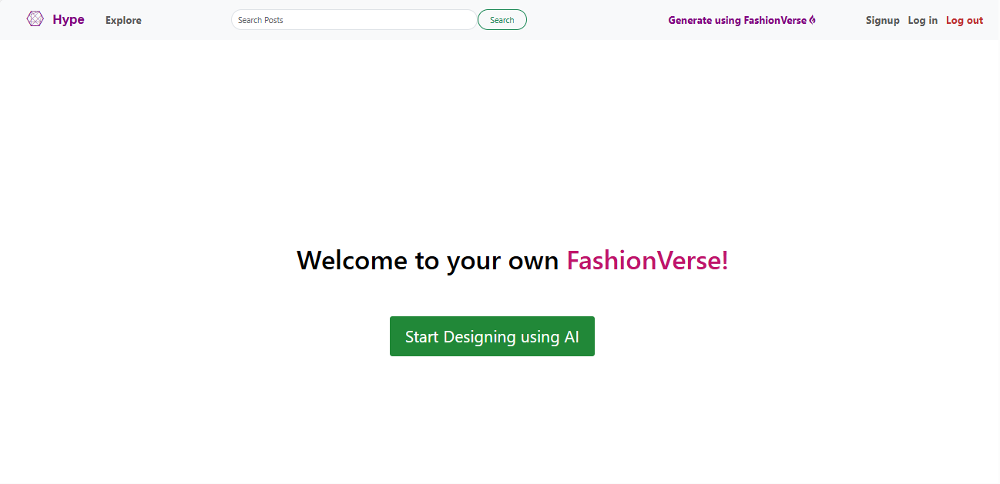
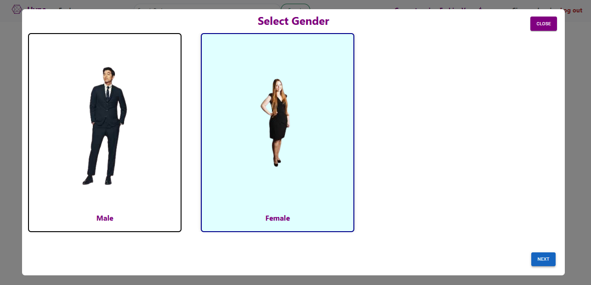
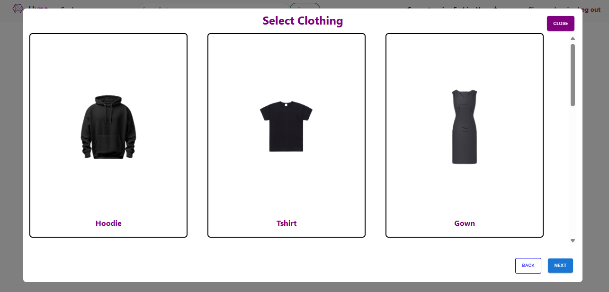
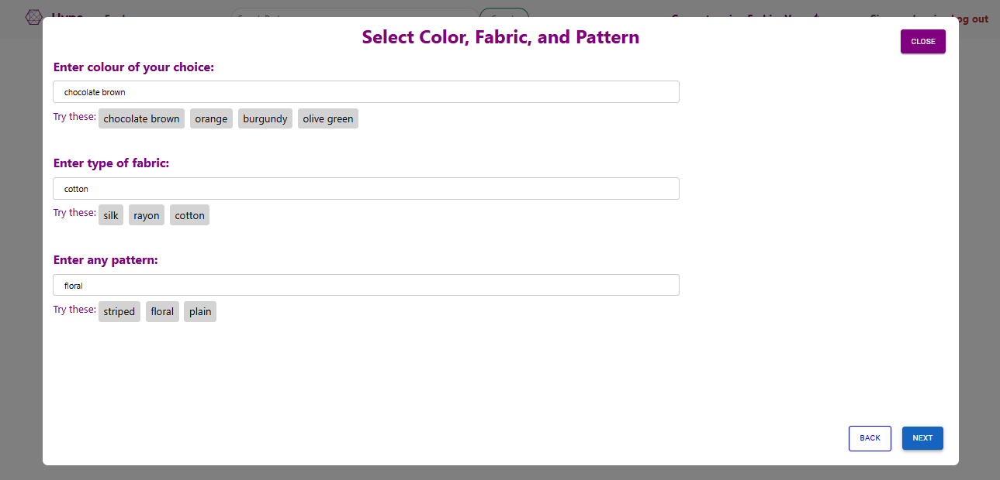
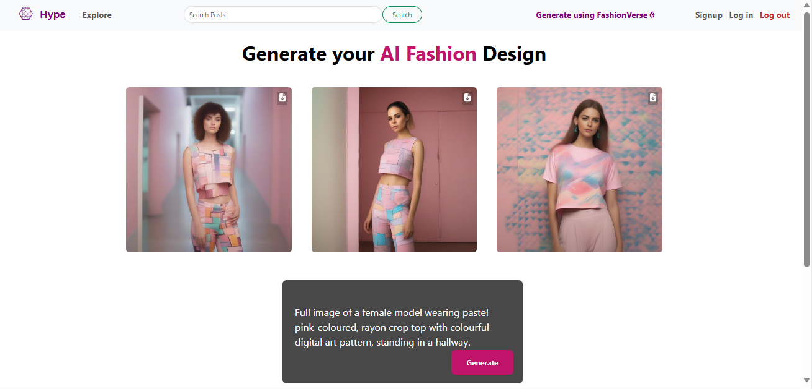
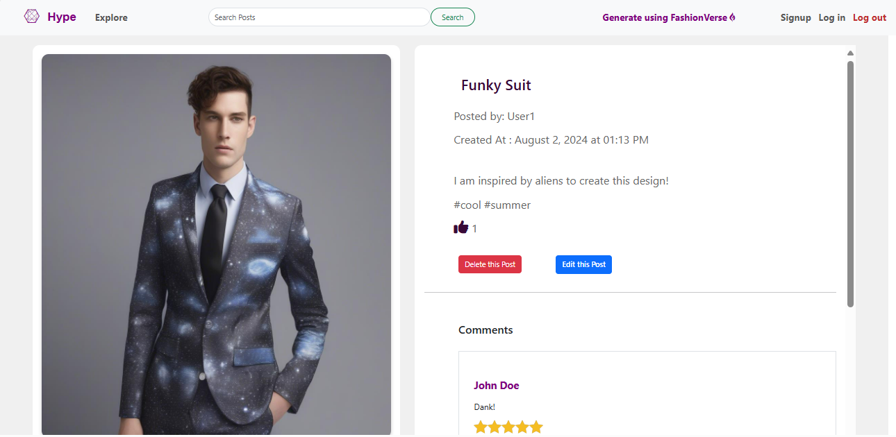
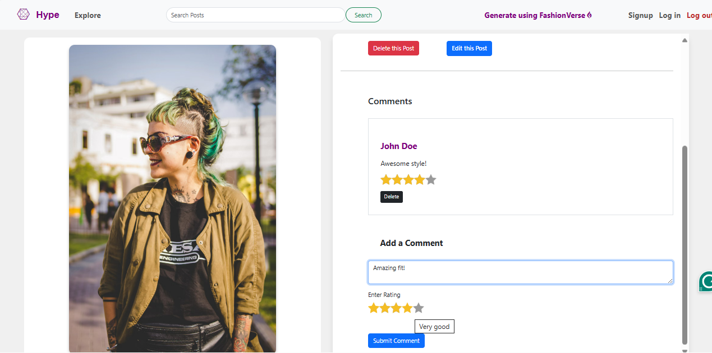
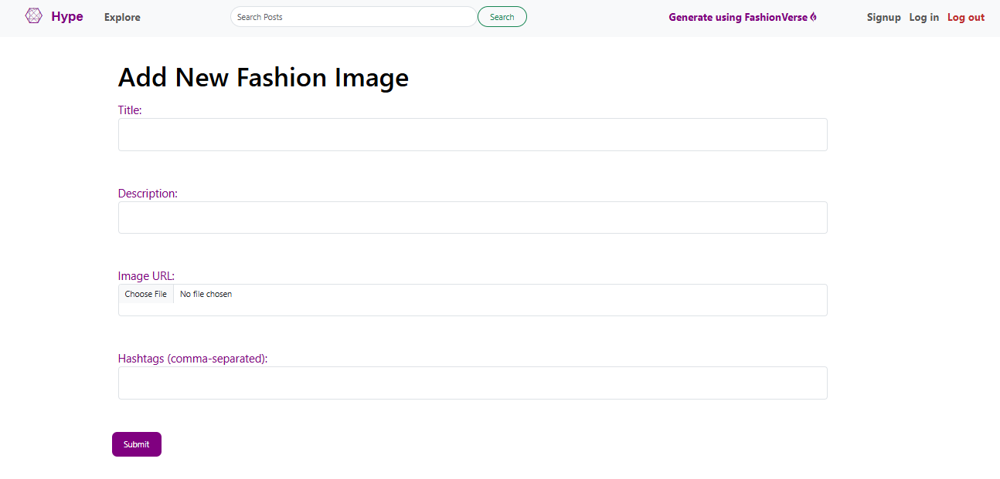

# Fashion Design Community Platform - Hype

This project is a comprehensive fashion design community platform that allows users to generate, upload, share, and interact with fashion images. Users can generate images in “FashionVerse” by using the Stable Diffusion API; upload their designs; comment, like, and share designs within the community.

## Table of Contents
- [Description](#description)
- [Technologies Used](#technologies-used)
- [Workflow](#workflow)
- [Features](#features)
- [Screenshots](#screenshots)

## Description
The platform is designed to foster a community where fashion enthusiasts can generate, upload, and share their designs. By leveraging AI for image generation and providing robust community features, the platform aims to be a hub for fashion creativity and interaction.

## Technologies Used
- **MongoDB**: For database management.
- **Express.js**: For backend framework.
- **React.js**: For frontend framework.
- **Node.js**: For server-side JavaScript runtime.
- **Stable Diffusion API**: For AI image generation based on user prompts.
- **Multer**: For handling file uploads.
- **Cloudinary**: For storing and managing images.
- **Bootstrap**: For responsive design and form validation.
- **Material-UI**: For icons and Styling
- **Font awesome**: For icons and styling.
- **Mongoose**: For MongoDB object modeling.
- **Dotenv**: For environment variable management.
- **Passport.js**: For authentication.
- **express-session**: Session Management
- **connect-flash**: Flash messages

## Workflow
1. **Image Generation**:
   - Users can generate images using the Stable Diffusion API by selecting various options such as gender, garment type, color, etc.
2. **Image Upload**:
   - Users can upload their own fashion images which are then stored in Cloudinary.
3. **Community Interaction**:
   - Users can like and comment on each other's designs. Comments and likes are stored in the MongoDB database.
4. **Image Management**:
   - Uploaded images can be deleted by the user. Comments can also be deleted.
5. **Image Sorting**:
   - Images are displayed in descending order based on the number of likes.

## Features
- **AI Image Generation**: Generate fashion images using the Stable Diffusion API.
- **Image Upload**: Upload and store images using Cloudinary.
- **Community Interaction**: Like and comment on images.
- **Responsive Design**: Responsive layout using Bootstrap.
- **Form Validation**: Client-side form validation using Bootstrap.
- **Image Sorting**: Images sorted by likes.

## Screenshots
Here are some screenshots of the website:

### Home Screen

### Image Generation

### Community Interaction

### Add a New Post
